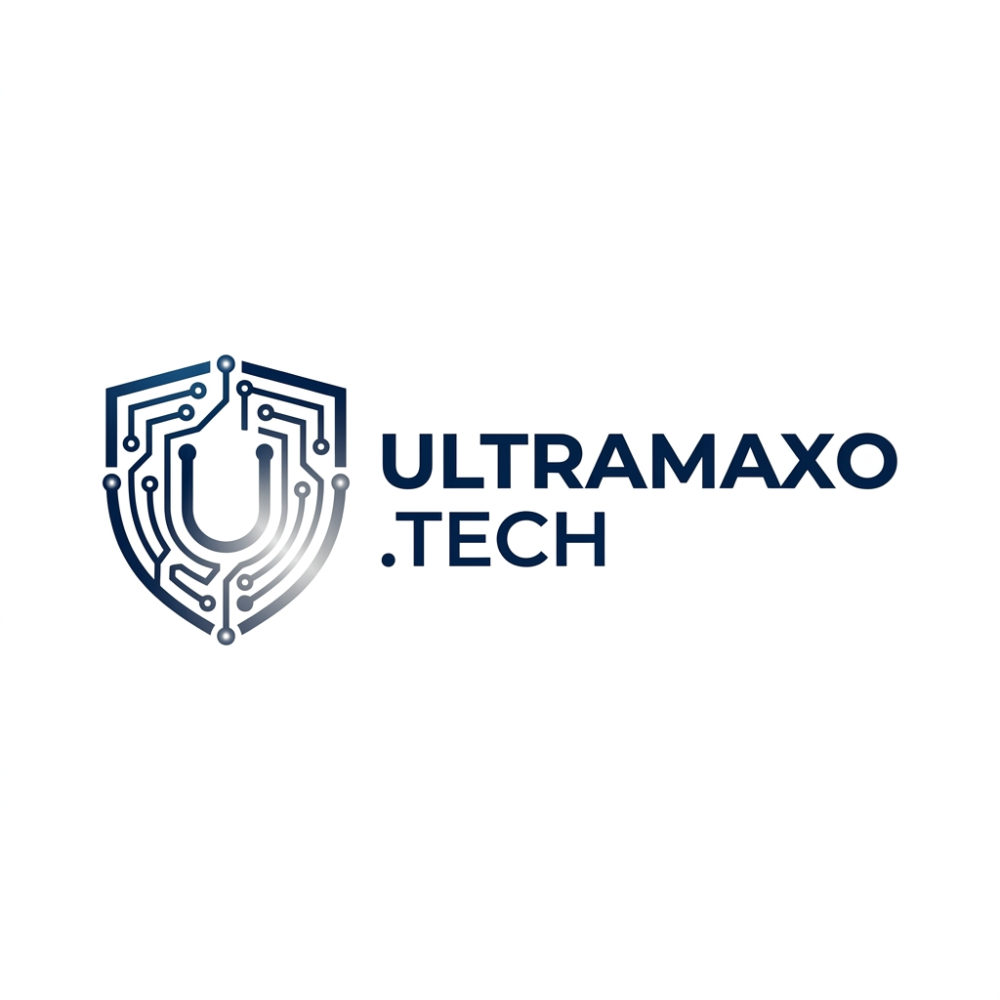

<div align="center">
  

  # UltramaxoMD
  WhatsApp Bot Multi-Device berbasis Baileys.<br>
  Dev: [@ptraxzy]
</div>

---

## Fitur
- 🔓 **RVO** — Buka pesan View Once (1x lihat)
- 🤖 **AI** — Chat AI (Grok)
- 📥 **Downloader** — TikTok, Musik, MediaFire
- 🔍 **Stalk** — IG, TikTok, Twitter, YouTube, GitHub, dll
- 🎮 **Games** — Tebak kata, catur, tic-tac-toe, asah otak
- 📊 **Cek-cek** — Khodam, tampan, cantik, kaya, janda, dll
- 📢 **Broadcast** — Kirim pesan massal ke semua grup

---

## Cara Pakai

### 1. Clone repo
```bash
git clone https://github.com/ptraxzy/UltramaxoMD.git
cd UltramaxoMD
```

### 2. Install dependencies
```bash
npm install
```


### 3. Edit config
Buka `config.js`, ganti nomor owner dan sesuaikan pengaturan lainnya:
```javascript
module.exports = {
  OWNER_ID: ["628xxx"],  // nomor WA kamu
  PREFIX: '.',
  botName: 'UltramaxoMD',
};
```

### 4. Jalankan bot
```bash
node index.js
```

### 5. Pairing
Setelah dijalankan, bot akan minta nomor WA dan memberikan **Kode Pairing**. Buka WhatsApp di HP → **Perangkat Tertaut** → **Tautkan dengan nomor telepon** → masukkan kode yang muncul di terminal.

---

## Command
Ketik `.menu` di chat untuk melihat semua fitur, atau `.allmenu` untuk daftar lengkap command.
